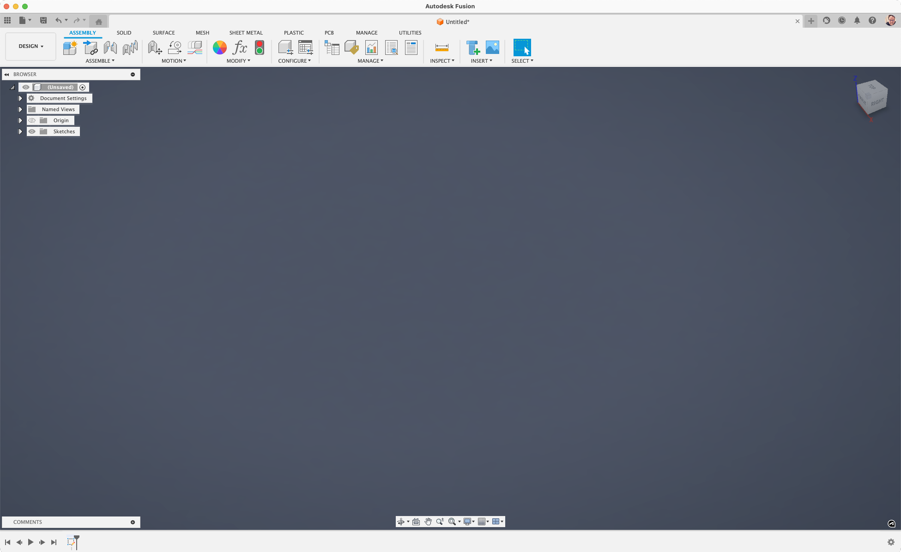

# Fusion360-Assembly-Tab

Add an assembly tab to Fusion 360 design documents

**!!! Backup you original TabToolbar.xml before using this new toolbar definition xml !!!**

On **Mac OS**, over-write the existing file here:

    /Users/ <Your User Name> /Library/Application Support/Autodesk/webdeploy/production/ <Current deployment GUID> /Autodesk Fusion 360.app/Contents/Libraries/Applications/Fusion/Fusion/UI/FusionUI/Resources/Toolbar/TabToolbars.xml`

On **Windows**, over-write the existing file here:

    \Users\ <Your User Name> \AppData\Local\Autodesk\webdeploy\production\ <Current deployment GUID> \Fusion\UI\FusionUI\Resources\Toolbar\Toolbar\TabToolbars.xml

Relaunch Fusion 360.

---

To uninstall, restore the original file you archived and restart Fusion 360.
